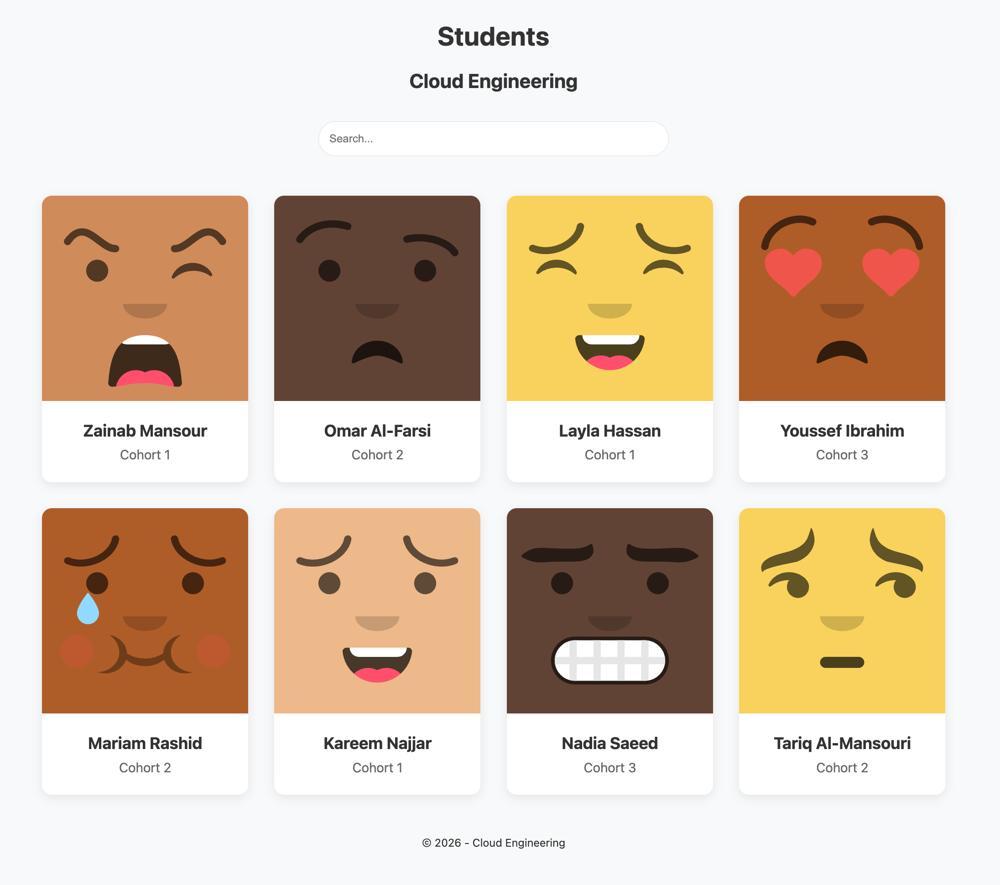
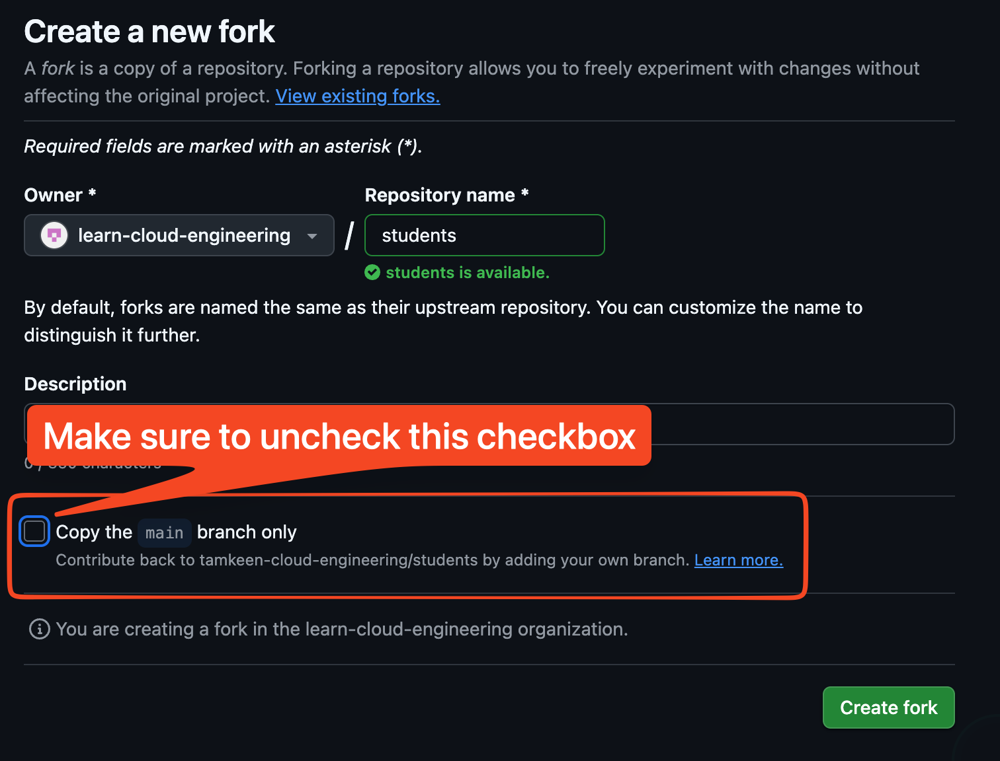
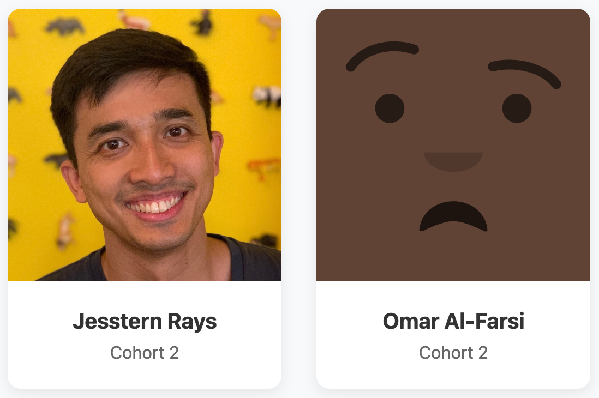

# Students



## Objectives

The objectives of this exercise is for you to learn:

- the difference between forking and cloning a repository,
- stage, commit, and push your changes,
- create a pull request to merge your changes to the upstream repository, and
- how to deal with merge conflicts.

## Fork the repository



Fork this repository on GitHub. This will create a copy on your GitHub account that you can edit. 

Make sure to uncheck "Copy `main` branch only" so that you fork all the branches. We want to also get the `students` branch from this repository.

## Clone the repository

Now, clone your own copy to your local machine to make changes.

```sh
git clone https://github.com/tamkeen-cloud-engineering/students.git
```

## Add your name and details

Edit the `students.json` file in the `data` folder and add your name and details.

```json
{ 
  "name": "Your Name Here",
  "cohort": 2,
  "photo": "https://your-photo-here.com",
}
```

## Add an image to your profile card

If you have an image hosted on the web, you can add it to your profile card. Otherwise a default image will be used. You can also generate your own avatar with [DiceBear](https://www.dicebear.com/).

For instance, you can generate a random avatar based on your name [https://api.dicebear.com/9.x/avataaars-neutral/svg?seed=Your+Name+Here](https://api.dicebear.com/9.x/avataaars-neutral/svg?seed=Your+Name+Here)



## Stage, commit, and push

Stage, commit, and push your changes to your remote repository on GitHub.

```sh
git add students.json
git commit -m "Add my name to student directory"
git push origin main
```

## Create a pull request

Create a pull request on GitHub to merge your changes to the upstream repository. Learn more about [creating pull requests](https://docs.github.com/en/pull-requests/collaborating-with-pull-requests/proposing-changes-to-your-work-with-pull-requests/creating-a-pull-request).

## Get updates from the `upstream` remote repository

First we add the `upstream` remote repository to our local repository. This is so that we can pull updates from the upstream repository.

```sh
git remote add upstream https://github.com/tamkeen-cloud-engineering/students.git
```

Check your remote repositories. You should see both `origin` and `upstream` remote repositories.

```sh
git remote -v
```

Next, we want to fetch the updates.

```sh
git fetch upstream
```

We pull the changes from the `students` branch of the upstream repository.

```sh
git pull upstream students --rebase
```

## Resolve merge conflicts

At this point, you may see merge conflicts. Go to the `students.json` file to fix those conflicts. A big part of collaborating with others in a team is resolving merge conflicts. This happens when one or more people are editing the same file. In this case, we will all be editing the `students.json` file.

In VS Code, we can click on the four options:

- `Accept Current Change` - this will keep your changes only
- `Accept Incoming Change` - this will keep their changes only
- `Accept Both Changes` - this will keep both yours and their changes
- `Compare Changes` - open a diff tool to compare changes

You must delete the `<<<<<<<`, `=======`, and `>>>>>>>` lines before saving.


```txt
<<<<<<< HEAD
This is the code currently on your local branch (e.g., main).
=======
This is the new code coming in from the other branch (e.g., students).
>>>>>>> students
```
